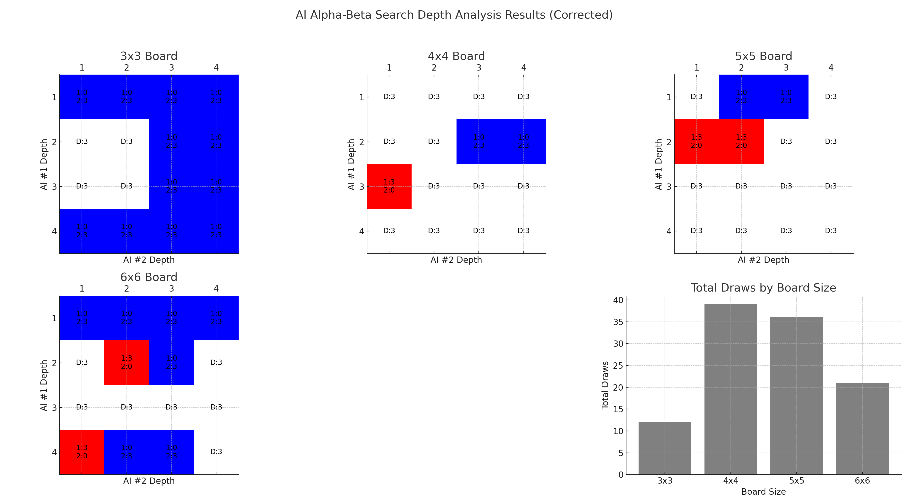

# Project 1 Connect M Computer Game

**Team Members:** Jairun Diemert
**Date:** 2025-02-24

---

## Project Description

This project implements a Connect M game where a human plays against a computer opponent. The game is solved using adversarial search with alpha-beta pruning to decide on the optimal move for the computer. The game’s objective is to place disks on a square board and connect a specified number of disks contiguously.

---

## Agent Model & Agent Environment

The computer agent is modeled as a rational maximizer whose goal is to choose moves that maximize its chance of winning while minimizing the potential for the human opponent. It does so by evaluating board states using a heuristic function and exploring possible moves using the alpha-beta pruning algorithm. The agent adapts its strategy based on the current board configuration and uses a recursive search to forecast the outcomes of moves.

The game environment is a two-dimensional grid (board) where players alternate turns to drop disks into columns. The environment is `fully observable` and `deterministic`. It enforces the game rules, including valid move detection, win condition checks (horizontal, vertical, and diagonal), and draw conditions. The design ensures that the agent’s decision-making process is closely tied to the feedback provided by the environment after each move.

---

## Data Structures

The primary data structure is a two-dimensional list (list of lists) representing the game board. Each cell in the board holds a single character: a space (' ') for an empty cell, 'X' for the human player's disk, and 'O' for the computer's disk. Additional state information such as board size, the win condition (connect_m), and turn information are stored as attributes of the game class. Move generation is efficiently handled by scanning the top row of each column to determine available moves.

The data structures were chosen for their simplicity and effectiveness in representing grid-based games, ensuring that the game state can be easily copied, modified, and evaluated during recursive searches.

---

## Alpha-Beta Pruning

The alpha-beta pruning algorithm is implemented using two mutually recursive functions, `maxValue` and `minValue`, that traverse the game tree. The algorithm maintains two values, alpha and beta, which represent the best already-explored scores for the maximizer and minimizer respectively. By pruning branches where the current node's value exceeds these bounds, the algorithm reduces the number of nodes evaluated, thereby increasing efficiency. The depth of the search is controlled by a parameter (currently set to 4 in `main.py`), which determines how many moves ahead the computer looks. This number can be changed for different level of difficulty. Currently in testing I have only been able to manage a `DRAW` with 3,3,1 & 4,4,1 and the depth set to 1.

```
FUNCTION AlphaBetaSearch(depth):
    // Initialize best score for the maximizer (computer) to negative infinity.
    best_score = -infinity
    // Initialize best move as undefined.
    best_move = None
    // Set the initial alpha and beta values.
    alpha = -infinity
    beta = +infinity

    // Loop through each valid move available from the current board state.
    FOR each valid move in current_board DO:
        // Apply the move to generate a new board state.
        new_board = ApplyMove(current_board, move, COMPUTER_SYMBOL)
        // Call the minimizer function on the new board state, reducing depth by 1.
        score = MinValue(new_board, alpha, beta, depth - 1)
        // If this move yields a better score, update best_score and best_move.
        IF score > best_score THEN:
            best_score = score
            best_move = move
        END IF
        // Update alpha with the best score so far.
        alpha = MAX(alpha, best_score)
    END FOR

    // Return the move that gives the best evaluated score.
    RETURN best_move
END FUNCTION


FUNCTION MaxValue(board, alpha, beta, depth):
    // Terminal test: if maximum depth reached or board is in a terminal state.
    IF depth == 0 OR IsTerminal(board) THEN:
        RETURN EvaluateBoardState(board)
    END IF

    // Initialize value for maximizer to negative infinity.
    value = -infinity

    // For each valid move from the current board state.
    FOR each valid move in board DO:
        new_board = ApplyMove(board, move, COMPUTER_SYMBOL)
        // Recursively evaluate the minimum value for the opponent's move.
        value = MAX(value, MinValue(new_board, alpha, beta, depth - 1))
        // Prune the branch if the value is already greater than or equal to beta.
        IF value >= beta THEN:
            RETURN value
        END IF
        // Update alpha to the maximum value found so far.
        alpha = MAX(alpha, value)
    END FOR

    RETURN value
END FUNCTION


FUNCTION MinValue(board, alpha, beta, depth):
    // Terminal test: if maximum depth reached or board is in a terminal state.
    IF depth == 0 OR IsTerminal(board) THEN:
        RETURN EvaluateBoardState(board)
    END IF

    // Initialize value for minimizer to positive infinity.
    value = +infinity

    // For each valid move from the current board state.
    FOR each valid move in board DO:
        new_board = ApplyMove(board, move, HUMAN_SYMBOL)
        // Recursively evaluate the maximum value for the computer's move.
        value = MIN(value, MaxValue(new_board, alpha, beta, depth - 1))
        // Prune the branch if the value is already less than or equal to alpha.
        IF value <= alpha THEN:
            RETURN value
        END IF
        // Update beta to the minimum value found so far.
        beta = MIN(beta, value)
    END FOR

    RETURN value
END FUNCTION
```

---

## Heuristic Evaluation Function

The heuristic evaluation function assesses the desirability of a board state by checking for winning conditions and potential winning segments. It returns a high positive score if the computer wins and a high negative score if the human wins. For non-terminal states, it examines rows, columns, and diagonals, scoring segments based on the number of contiguous disks present. The scoring is exponential, using powers of 10 based on the count of disks in a segment, to emphasize moves that are closer to achieving a win. This function directly influences the decision-making process of the alpha-beta pruning algorithm. Current WIN returns 10^5 and LOSE returns -10^5.

```
FUNCTION EvaluateBoardState(board):
    // Check terminal conditions first
    IF CheckWinState(board, COMPUTER_SYMBOL) THEN
        RETURN HIGH_POSITIVE_VALUE  // e.g., 1000000
    END IF

    IF CheckWinState(board, HUMAN_SYMBOL) THEN
        RETURN HIGH_NEGATIVE_VALUE  // e.g., -1000000
    END IF

    // Initialize score to zero for non-terminal states
    score = 0

    // Evaluate horizontal segments
    FOR each row in board DO
        FOR col from 0 to (BOARD_SIZE - CONNECT_M) DO
            segment = ExtractSegment(row, col, CONNECT_M)
            score = score + EvaluateSegment(segment)
        END FOR
    END FOR

    // Evaluate vertical segments
    FOR col from 0 to BOARD_SIZE - 1 DO
        FOR row from 0 to (BOARD_SIZE - CONNECT_M) DO
            segment = ExtractVerticalSegment(board, col, row, CONNECT_M)
            score = score + EvaluateSegment(segment)
        END FOR
    END FOR

    // Evaluate diagonal segments (top-left to bottom-right)
    FOR row from 0 to (BOARD_SIZE - CONNECT_M) DO
        FOR col from 0 to (BOARD_SIZE - CONNECT_M) DO
            segment = ExtractDiagonalSegment(board, row, col, CONNECT_M, direction="down-right")
            score = score + EvaluateSegment(segment)
        END FOR
    END FOR

    // Evaluate anti-diagonal segments (top-right to bottom-left)
    FOR row from 0 to (BOARD_SIZE - CONNECT_M) DO
        FOR col from CONNECT_M - 1 to (BOARD_SIZE - 1) DO
            segment = ExtractDiagonalSegment(board, row, col, CONNECT_M, direction="down-left")
            score = score + EvaluateSegment(segment)
        END FOR
    END FOR

    RETURN score
END FUNCTION


FUNCTION EvaluateSegment(segment):
    // If the segment contains disks from both players, it's blocked.
    IF Count(segment, HUMAN_SYMBOL) > 0 AND Count(segment, COMPUTER_SYMBOL) > 0 THEN
        RETURN 0
    END IF

    // If the segment contains only computer disks, score positively.
    IF Count(segment, COMPUTER_SYMBOL) > 0 THEN
        RETURN 10^(Count(segment, COMPUTER_SYMBOL))
    END IF

    // If the segment contains only human disks, score negatively.
    IF Count(segment, HUMAN_SYMBOL) > 0 THEN
        RETURN - (10^(Count(segment, HUMAN_SYMBOL)))
    END IF

    // If the segment is completely empty, it contributes no score.
    RETURN 0
END FUNCTION
```

---

## Analysis of Computer vs. Computer Simulations

### **Hypothesis Driving the Analysis**

The core hypothesis behind this analysis is based on the behavior of **adversarial search algorithms**, specifically the impact of **search depth** when two AI agents play against each other using identical strategies. The central assumption is:

> **If both AI players use the same search depth and identical heuristics within the alpha-beta pruning algorithm, the game should consistently result in a draw, regardless of the board configuration (size or the number of consecutive chips needed to win).**

Since both AIs explore the same game tree with equivalent depth and logic, neither should gain an inherent advantage—each move is perfectly countered, leading to a balanced stalemate.

---

### **Why Test Depth and Board Configurations?**

Exploring different search depths and board configurations provides valuable insights for game AI development and adversarial learning:

1. **Identifying Depth-Based Advantages:**
   A deeper search allows an AI to evaluate more future moves, leading to smarter plays and potentially earlier recognition of winning opportunities or defensive strategies. By varying the search depths between two AIs, we observe when one AI starts to consistently outperform the other.

2. **Increasing Complexity with Board Size:**
   Larger boards exponentially expand the search space, making it more difficult for shallow search depths to anticipate long-term consequences. Testing different board sizes (e.g., 3×3 to 6×6) reveals how complexity influences outcomes, particularly the likelihood of draws.

3. **Depth vs. Board Size Trade-off:**
   - On **smaller boards**, even slight depth advantages often result in wins because the limited search space makes it easier to foresee all possible moves.
   - On **larger boards**, the advantage of a deeper search diminishes unless the depth scales with the increased complexity. Draws become more common as both AIs struggle to find winning strategies in vast search spaces.

4. **Finding the Tipping Point:**
   This analysis identifies at which depth advantage or board size complexity the balance shifts from a draw to a consistent win for the stronger AI. This helps optimize depth settings relative to board size for future AI development.

---

### **Test Design**

To test the hypothesis systematically, the following parameters were used:

1. **Board Sizes:**
   Simulations were run on board sizes from **3×3** to **6×6**.

2. **Winning Condition (Connect-M):**
   The required number of consecutive chips to win was set equal to the board size (e.g., **3 chips** on a **3×3** board).

3. **Search Depths:**
   Both AI #1 and AI #2 were assigned depths from **1** to **4** across all possible depth combinations.

4. **First-Move Advantage:**
   Tests were run with **AI #1 moving first** in all scenarios to assess whether moving first, combined with deeper searches, could influence the outcome.

5. **Outcome Metrics:**
   Each configuration was run multiple times, recording results as:
   - **AI #1 Wins**
   - **AI #2 Wins**
   - **Draws**

---

### **Significance of the Analysis**

Understanding how search depth and board complexity affect game outcomes is essential for:

- **AI Difficulty Tuning:**
  Optimizing AI behavior for different difficulty levels by balancing search depth with computational efficiency.

- **Adversarial Learning:**
  Training stronger AI models by simulating evenly matched agents playing against themselves, fostering more sophisticated strategies.

- **Resource Management:**
  Identifying the minimum necessary depth for optimal play on larger boards without consuming excessive computational resources.

In essence, this analysis explores the relationship between computational depth, board size, and AI performance, helping us understand where strategic dominance shifts and how to design more intelligent game AIs.

#### **Analysis Outcome**



---

### **How to Interpret the Visual:**

#### **Heatmaps (Top-Left to Bottom-Left)**
Each heatmap corresponds to a board size:
- **X-Axis:** AI #2 Depth
- **Y-Axis:** AI #1 Depth
- **Colors:**
  - **Red:** AI #1 wins dominate (3-0)
  - **Blue:** AI #2 wins dominate (3-0)
  - **Gray:** Draws across all games (`D:3`)

**Annotations within each cell:**
- **`1:x`** → Number of wins for AI #1
- **`2:x`** → Number of wins for AI #2
- **`D:3`** → All three games ended in a draw

##### Key Insights by Board:
- **3×3 Board:**
  - Depth advantages drastically shift outcomes.
  - Draws happen when both AIs have equal depths (gray cells).
- **4×4 Board:**
  - Balanced outcomes with more draws at equal depths.
  - Depth advantage leads to clear wins for the deeper searcher.
- **5×5 Board:**
  - Similar trends as 4×4 but with increased draws.
  - Slight depth differences impact outcomes noticeably.
- **6×6 Board:**
  - Larger board complexity leads to more draws overall.
  - Strong depth disparities still lead to dominant wins.

---

#### **Bar Chart (Bottom-Right)**
- Displays the total number of draws for each board size.
- **4×4** and **5×5** boards show the highest number of draws, reflecting balanced gameplay with equal depth configurations.
- The **3×3** board results in fewer draws, with clear dominance from depth advantages.
- The **6×6** board reflects increasing game complexity but still rewards deeper searches.

---

### **Conclusions**
1. **Search Depth Matters:**
   A deeper search consistently results in stronger AI performance, particularly on smaller boards.
2. **Board Size Affects Balance:**
   Larger boards tend to favor draws unless there’s a significant depth advantage.
3. **Equal Depths Encourage Draws:**
   When both AIs use the same search depth, outcomes are balanced, demonstrating fair gameplay.